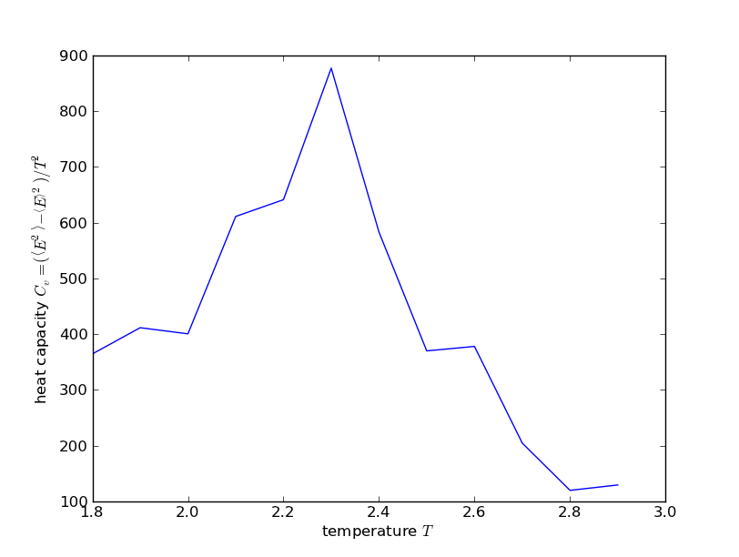
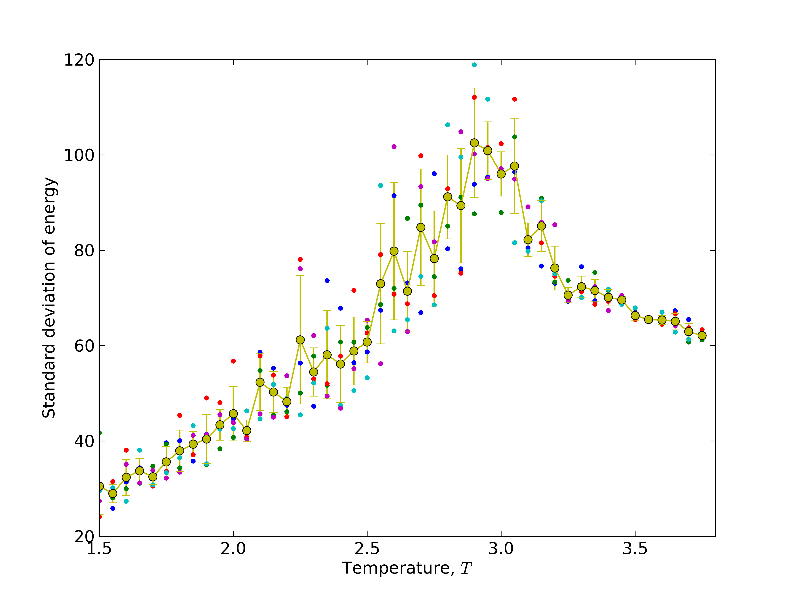
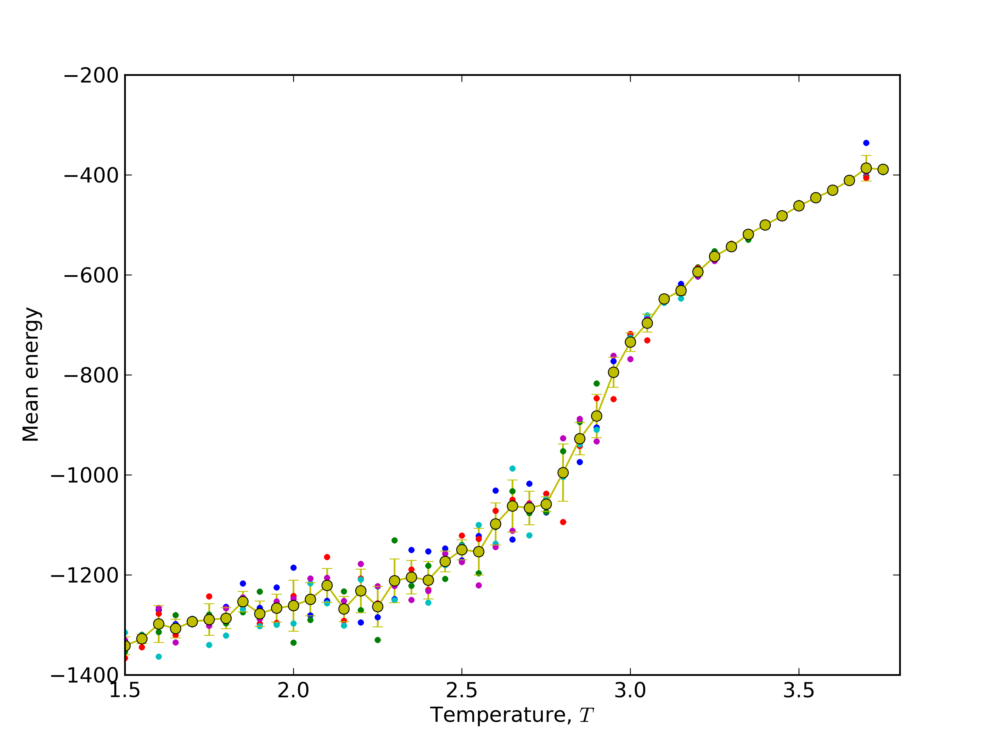
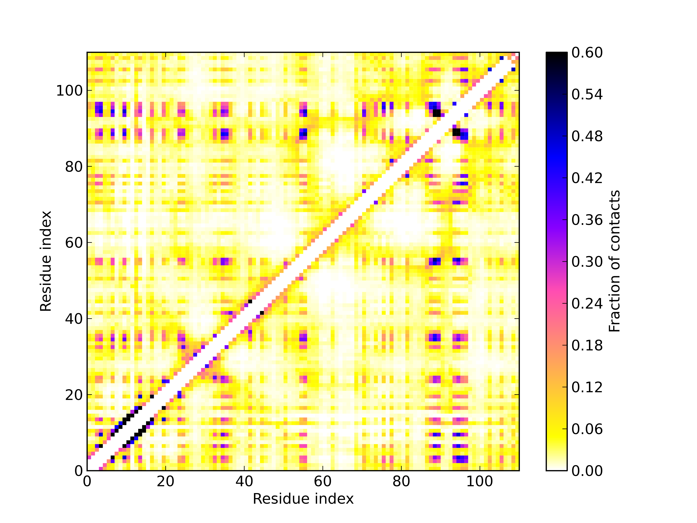

=========
Tutorial
=========

Calculating heat capacity, :math:`C_v` 
=======================================
.. math:: 
	C_v(T) = \frac{\left<E^2\right> - \left<E\right>^2}{T^2}

.. literalinclude:: ../examples/heat_capacity.py

Download script: :download:`heat_capacity.py <../examples/heat_capacity.py>`.

Study folding pathway: 1) create standard deviation and mean energy plots for Barnase
=====================================================================================

.. literalinclude:: ../examples/folding_pathway/folding_pathway.py

Download script: :download:`folding_pathway.py <../examples/folding_pathway/folding_pathway.py>`.
Download necessary files: :download:`1bnr.pdb <../examples/folding_pathway/1bnr.pdb>`, :download:`1bnr.dssp <../examples/folding_pathway/1bnr.dssp>`

Results:

Study folding pathway: 2) calculate average contact map over trajectory of sidegroups in temperature 2.1
=========================================================================================================

.. literalinclude:: ../examples/folding_pathway/contact_map.py

Download script: :download:`contact_map.py <../examples/folding_pathway/contact_map.py>`.

Results:

Optionally, GNUplot script for plotting contact_map.dat file generated by contact_map.py script:

.. literalinclude:: ../examples/folding_pathway/gnuplot_script.gp

Download script: :download:`gnuplot_script.gp <../examples/folding_pathway/gnuplot_script.gp>`.

Monitoring of CABS energy during simulation
===========================================

.. literalinclude:: ../examples/monitoring_energy.py

Download script: :download:`monitoring_energy.py <../examples/monitoring_energy.py>`.

Monitoring of end-to-end distance of chain during simulation
============================================================

.. literalinclude:: ../examples/monitoring_e2e_distance.py

Download script: :download:`monitoring_e2e_distance.py <../examples/monitoring_e2e_distance.py>`.

De-novo modeling of 2PCY structure
==================================

.. literalinclude:: ../examples/de_novo.py

Download script: :download:`de_novo.py <../examples/de_novo.py>`.

